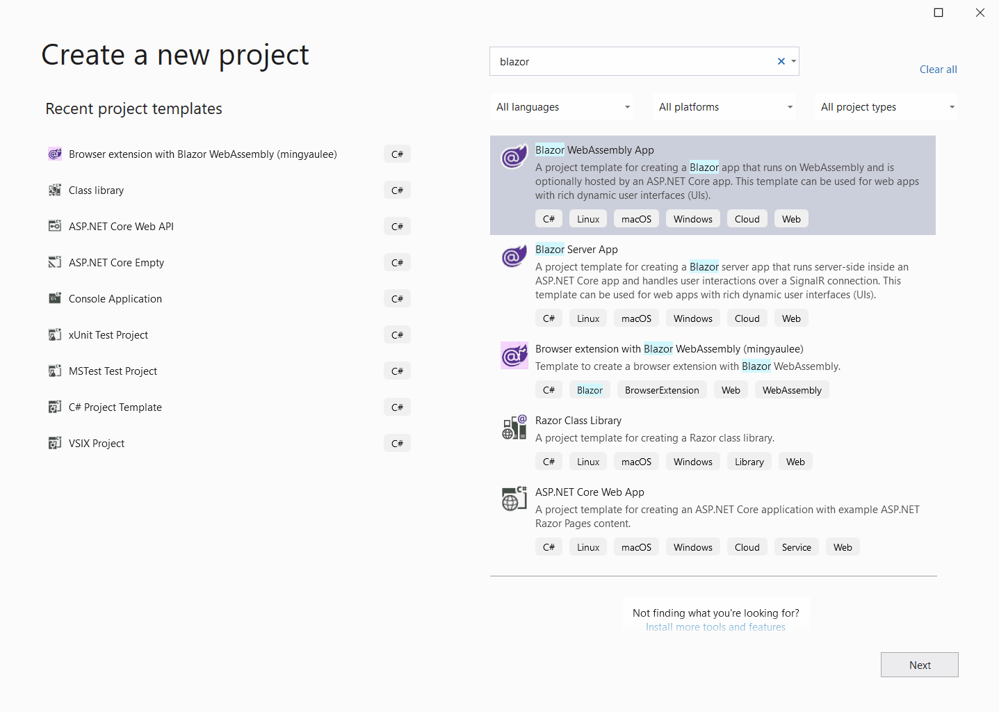

# Blazor.BrowserExtension
[](https://www.nuget.org/packages/Blazor.BrowserExtension/)
[](https://github.com/mingyaulee/Blazor.BrowserExtension/actions/workflows/Blazor.BrowserExtension-Build.yml)
[](https://sonarcloud.io/dashboard?id=Blazor.BrowserExtension)

You can now easily build a browser extension with Blazor!

## Manifest V3 support is here!

At the moment, Chromium based browsers (Chrome & Edge) has support for the manifest V3 specification and manifest V2 is deprecated.

Firefox's implementation is in progress.
1. [Post 1](https://blog.mozilla.org/addons/2021/05/27/manifest-v3-update/)
2. [Post 2](https://blog.mozilla.org/addons/2019/12/12/test-the-new-csp-for-content-scripts/)
3. Check on the progress from the [Firefox blog](https://blog.mozilla.org/addons/tag/manifest-v3/).

Check out the [migration guide](ManifestV3Migration.md) from manifest V2 to V3.

> **Important Note:** Only .Net 7 is supported for manifest V3. We are using a custom version of `dotnet.js` runtime to overcome the CSP compliance issue that will only be release in .Net 8.

## Demo


## How to use this package

> **Important for v0.\*.\*:**<br />
> This package is still in pre-release stage so the versioning does not comply with semantic versioning. Feature and bug fix increments the patch version and breaking change increments the minor version. So be sure to check the release note before upgrading between minor version.

This package imports two other packages, which are:
1. [WebExtensions.Net](https://github.com/mingyaulee/WebExtensions.Net) - Provides interop for WebExtensions standard API.
2. [JsBind.Net](https://github.com/mingyaulee/JsBind.Net) - Provides advanced JavaScript interop features used by WebExtensions.Net.
3. Blazor.BrowserExtension.Build (in this repository) - Adds build targets and tasks to the project.

### Samples/References

Sample projects are available in the repository [Blazor.BrowserExtension.Samples](https://github.com/mingyaulee/Blazor.BrowserExtension.Samples).

You can also refer to the following projects for real life extensions:
- [Blazor Edge New Tab](https://github.com/dragnilar/EdgeExtensionsBlazor) - Published for [Chrome](https://chrome.google.com/webstore/detail/blazor-edge-new-tab/bdcfngldhocoffghnlmhibpifmoakiec?hl=en&authuser=0) and [Edge](https://microsoftedge.microsoft.com/addons/detail/blazor-edge-new-tab/bfhdepjammnaoddhikhogfbnikmeocfj).

Or check out the [GitHub dependency graph](https://github.com/mingyaulee/Blazor.BrowserExtension/network/dependents?package_id=UGFja2FnZS0yMDQyMjY4MDIy) for more repositories.

### Create new project
1. Run `dotnet new --install Blazor.BrowserExtension.Template`.
0. Run `dotnet new browserext --name <ProjectName>` to initialize a new project with the template.
0. Change the working directory into the newly created project directory.
0. Run `dotnet build` to build the project.

> If you are using Visual Studio, you can do all these from the UI after installing the template NuGet package, like how I did in the demo above (once you have enabled showing .Net Core templates in the New project dialog).

### Setup existing project
Refer to [this guide](SetupExistingProject.md) for setting up existing project.

## Pre-initialization script (app.js)
A custom script can be run before the initialization of the Blazor application.
This is particularly useful for content scripts because we need to inject a `DIV` element as the container for the Blazor application before it is initialized.

To do so, create a file named `app.js` under the directory `wwwroot` in your project.
The file will automatically be detected during the build and the `app.js` file will be executed every time the Blazor application is going to be initialized.

> Note: the `app.js` file will need to be added to the `web_accessible_resources` in the `manifest.json` file

### Change initialization behaviour
Using an `app.js`, you can set the following properties in the `BlazorBrowserExtension` global object to change the initialization behaviour.

| Property Name               | Description                                                                                                                                                         |
| --------------------------- | ------------------------------------------------------------------------------------------------------------------------------------------------------------------- |
| ImportBrowserPolyfill       | Set to `false` to disable importing of the browser polyfill script.<br />Default: `true`                                                                            |
| StartBlazorBrowserExtension | Set to `false` to prevent auto initialization of Blazor. Use `BlazorBrowserExtension.BrowserExtension.InitializeAsync` to initialize manually.<br />Default: `true` |

**Example:**

```javascript
globalThis.BlazorBrowserExtension.ImportBrowserPolyfill = false;
globalThis.BlazorBrowserExtension.StartBlazorBrowserExtension = false;
globalThis.BlazorBrowserExtension.BrowserExtension.InitializeAsync("Production");
```

## Build and load extension
### Google Chrome
1. Launch the Extensions page ( ⋮ → More tools → Extensions).
2. Switch on `Developer mode`.
3. Click on the `Load unpacked` button, then navigate to `%ProjectDir%\bin\Debug\net7.0\` and select the folder `browserextension`.

### Microsoft Edge
1. Launch the Extensions page ( ⋮ → Extensions).
2. Click on the ☰ and switch on `Developer mode`.
3. Click on the button with the title `Load unpacked`, then navigate to `%ProjectDir%\bin\Debug\net7.0\` and select the folder `browserextension`.

### Mozilla Firefox
1. Navigate to the URL [about:debugging#/runtime/this-firefox](about:debugging#/runtime/this-firefox)
2. Click on `Load Temporary Add-on...`, then navigate to `%ProjectDir%\bin\Debug\net7.0\browserextension` and select any file in the directory.

## Debugging locally in IIS Express or Kestrel
1. Start the Blazor project directly from Visual Studio or `dotnet run`.
0. Once the application is loaded, use the Blazor debugging hotkey Shift+Alt+D to launch the debugging console.

> At the moment, debugging when the application is loaded as an extension in the browser is not possible.
> This is because debugging requires a NodeJs debugging proxy launched by the DevServer, which is not available when loaded as extension in the browser.

## Browser Extension features

### Add a browser action popup page
Add the following to the `manifest.json`

For manifest V3
```json
"action": {
  "default_popup": "popup.html"
},
```

For manifest V2
```json
"browser_action": {
  "default_popup": "popup.html"
}
```

Add a `Popup.razor` Razor component under `Pages` folder with the following content.
```razor
@page "/popup.html"
@inherits Blazor.BrowserExtension.Pages.BasePage

<h1>My popup page</h1>
```

### Add an extension options page
Add the following to the `manifest.json`
```json
"options_ui": {
  "page": "options.html",
  "open_in_tab": true
}
```
Add a `Options.razor` Razor component under `Pages` folder with the following content.
```razor
@page "/options.html"
@inherits Blazor.BrowserExtension.Pages.BasePage

<h1>My options page</h1>
```

### Add a content script
Add the following to the `manifest.json`

For manifest V3
```json
"content_scripts": [
  {
    "matches": [ "*://*/*" ],
    "js": [ "content/Blazor.BrowserExtension/ContentScript.js" ]
  }
],
...
"web_accessible_resources": [
  {
    "resources": [
      ...
      "app.js"
    ],
    ...
  }
]
```

For manifest V2
```json
"content_scripts": [
  {
    "matches": [ "*://*/*" ],
    "js": [ "content/Blazor.BrowserExtension/ContentScript.js" ]
  }
],
...
"web_accessible_resources": [
  ...
  "app.js"
],
```

Add a `ContentScript.razor` Razor component under `Pages` folder with the following content.
```razor
@page "/contentscript.html"
@inherits Blazor.BrowserExtension.Pages.BasePage

<h1>My content script</h1>
```
Additional changes are required for content scripts to not have conflict of the element ID of the Blazor root component with any other elements in any pages it is injected in.

First of all, decide on a unique ID to be used for the application `DIV` container, such as `My_Unique_Extension_App_Id` (**this ID is used in the steps below, replace with your own unique ID**).
It should be unique enough that it does not collide with any existing element in the pages where the content scripts are going to be injected.

1. In `index.html` change the ID `app` of line `<div id="app">Loading...</div>` to `My_Unique_Extension_App_Id`.
2. In `Program.cs` change the ID `#app` of line `builder.RootComponents.Add<App>("#app");` to `#My_Unique_Extension_App_Id`.
3. Add a new file named `app.js` under the directory `wwwroot` (Skip this if it has been created already).
4. Add the following code in the `app.js` file to inject a new `DIV` element with the matching ID into the current page.
   ```javascript
   if (globalThis.BlazorBrowserExtension.BrowserExtension.Mode === globalThis.BlazorBrowserExtension.Modes.ContentScript) {
     const appDiv = document.createElement("div");
     appDiv.id = "My_Unique_Extension_App_Id";
     document.body.appendChild(appDiv);
   }
   ```

In `App.razor`, add the following `if` statement to opt out of routing only for content scripts.
```razor
@using My.Project.Pages;
@inject Blazor.BrowserExtension.IBrowserExtensionEnvironment BrowserExtensionEnvironment

@if (BrowserExtensionEnvironment.Mode == BrowserExtensionMode.ContentScript)
{
    <ContentScript></ContentScript>
}
else
{
    <Router ...>
        ...
    </Router>
}
```

## Browser Extension API
When you inherit from the `BasePage`, a few properties are injected for you to consume.
This includes the WebExtensions API and Logger.
The WebExtensions API is provided by the package [WebExtensions.Net](https://github.com/mingyaulee/WebExtensions.Net), and you can consume the API in a page:
```razor
@inherits Blazor.BrowserExtension.Pages.BasePage;

<button @onclick="GetIndexPageUrl">Get index page URL</button>
<p>@indexPageUrl</p>

@code {
    string indexPageUrl = null;
    async Task GetIndexPageUrl()
    {
        indexPageUrl = await WebExtensions.Runtime.GetURL("index.html");
    }
}
```

## How does routing work
Visit [this page](Routing.md) to read about routing in browser extensions.

## Customize build

The following MSBuild properties can be specified in your project file or when running `dotnet run`, `dotnet build` and `dotnet publish` command.

| Property                          | Default value                                        | Description                                                                      |
| --------------------------------- | ---------------------------------------------------- | -------------------------------------------------------------------------------- |
| BrowserExtensionEnvironment       | Blazor default: Production                           | The environment name which the Blazor application will run in.                   |
| IncludeBrowserExtensionAssets     | true                                                 | If set to false, the JavaScript files will not be added to the project.          |
| BrowserExtensionBootstrap         | False                                                | If set to True, the project will be bootstrapped during the build.               |
| BuildBlazorToBrowserExtension     | True                                                 | If set to False, the Blazor to Browser Extension build target will be skipped.   |
| PublishBlazorToBrowserExtension   | True                                                 | If set to False, the Blazor to Browser Extension publish target will be skipped. |
| BrowserExtensionAssetsPath        | wwwroot                                              | The root folder of the browser extension.                                        |
| BrowserExtensionOutputPath        | browserextension                                     | The folder of the build/publish output.                                          |
| BrowserExtensionRoutingEntryFile  | index.html                                           | The HTML entry file for the Blazor application.                                  |
| BrowserExtensionEnableCompression | $(BlazorEnableCompression)<br />Blazor default: True | If set to True, the .br compressed files will be loaded instead of .dll.         |

## Additional Information
Find out how to build a cross browser extension with the links below:
1. [MDN - Building a cross-browser extension](https://developer.mozilla.org/en-US/docs/Mozilla/Add-ons/WebExtensions/Build_a_cross_browser_extension)
2. [David Rousset - Creating One Browser Extension For All Browsers: Edge, Chrome, Firefox, Opera, Brave And Vivaldi](https://www.smashingmagazine.com/2017/04/browser-extension-edge-chrome-firefox-opera-brave-vivaldi/)

If you want to publish the extension to the browser extension stores, do take note of the following (courtesy of [@dragnilar](https://github.com/mingyaulee/Blazor.BrowserExtension/issues/39)):
- Publishing to the Microsoft Edge Add-ons store is easier as long as you note somewhere in the testing steps and/or description that the extension uses Blazor. It's slower than Google but it's pretty much a hassle free experience.
- Publishing to Google Chrome Extension store is more difficult. They will reject your extension at first if you declare any chromium apis in the manifest. Their automated testing doesn't work with Blazor / WASM yet but the support team will help you to resolve the challenges throughout the process.
